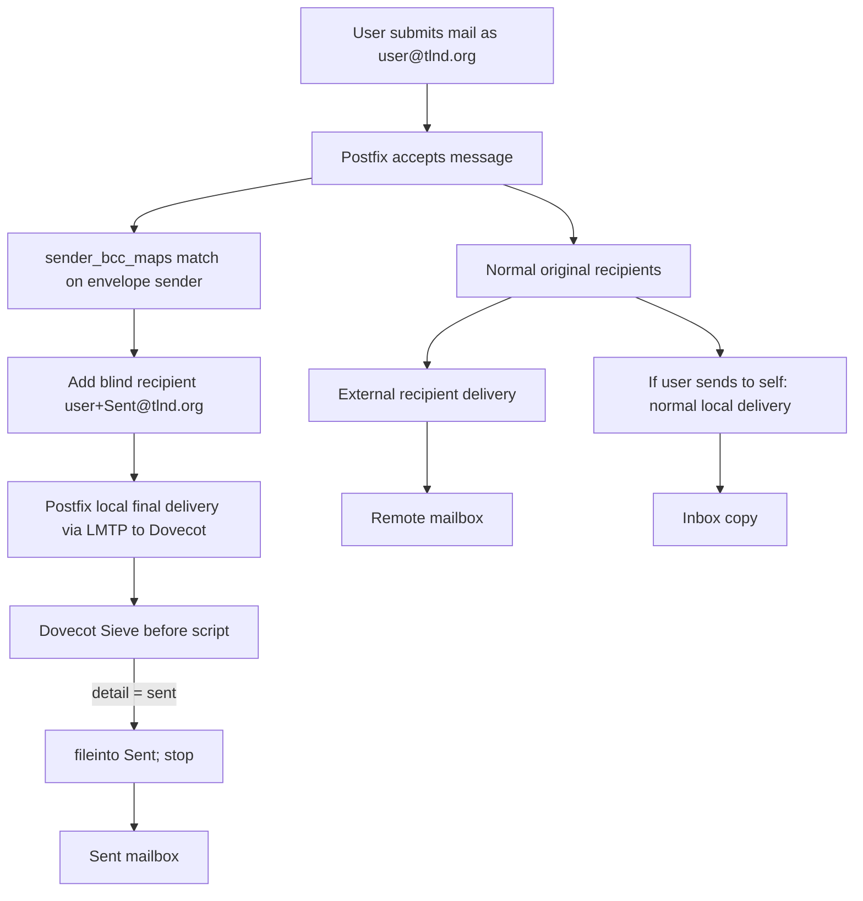

# Domain-wide Postfix and Dovecot Sent-copy design for tlnd.org

## Executive summary

The cleanest design for `user@tlnd.org -> user+Sent@tlnd.org -> Sent mailbox` is to let Postfix add one extra blind recipient based on the **envelope sender** with `sender_bcc_maps`, and let Dovecot Sieve file mail addressed to the `+Sent` detail into the user’s `Sent` mailbox. On the Dovecot side, the most robust match is against the **envelope recipient detail** (`:detail "to"`) rather than a `Delivered-To` header, because envelope-based matching is exactly what the Sieve plus-address examples are written for. On the IMAP side, mark `Sent` as `special_use = \Sent` and `auto = subscribe`, so clients see the correct folder and Dovecot creates/subscribes it automatically. citeturn22view0turn35view1turn34view0turn34view3

For your specific goal, a **regexp or PCRE sender_bcc map** is the only purely Postfix-native way to build `user+Sent@tlnd.org` generically from `user@tlnd.org`. A plain `hash:` map can do it only if you explicitly generate one row per mailbox. `sender_canonical_maps` and other canonical rewrites are the wrong tool because they **rewrite** sender addresses; they do not create an extra copy. `recipient_bcc_maps` keys off the recipient, not the sender, and `always_bcc` sends one fixed blind copy of every message to one fixed address, which is useful for compliance archives but not for “each user gets their own Sent copy.” citeturn22view0turn22view1turn22view2turn22view3

One important operational caveat: Postfix `sender_bcc_maps` is keyed by the **envelope sender** for new mail entering Postfix, not by the SASL login alone. If you enable it broadly in `main.cf` on a public MX, mail entering from the Internet with `MAIL FROM:<user@tlnd.org>` can also match. Best practice is to scope this behavior to your authenticated submission path if possible; Postfix supports service-specific `master.cf` parameter overrides, and it also has a separate `cleanup_service_name` knob for submission-specific cleanup behavior. Exact wiring there depends on how your Postfix instance is organized, so test that scoping explicitly before rollout. citeturn22view0turn39view0turn40view0

## Postfix option space

In the current Postfix parameter set, the BCC controls that matter are `sender_bcc_maps`, `recipient_bcc_maps`, and `always_bcc`. `sender_bcc_maps` adds one blind recipient looked up from the **envelope sender**; `recipient_bcc_maps` does the same keyed by the **envelope recipient**; and `always_bcc` adds one fixed blind recipient to every message received by Postfix. I did **not** find a separate current `sender_bcc_classes` knob in the current `postconf(5)` parameter set, so the practical knobs for this design are the three above plus the canonical maps if you want rewrites for other reasons. citeturn22view0turn22view1turn22view2

`sender_bcc_maps` is the right knob when the policy is “for messages submitted as `user@tlnd.org`, add one extra recipient.” It supports lookup fallbacks for `user+ext@domain`, `user@domain`, localpart-only forms for local domains, and `@domain.tld`. That last `@domain` lookup is useful if you want a **single archive mailbox for an entire domain**, but it cannot dynamically construct `user+Sent@tlnd.org` from the sender localpart. Only regexp/PCRE result substitution can do that generically inside Postfix itself. citeturn22view0turn37view0turn29view1

`sender_canonical_maps` rewrites sender addresses in the envelope and headers. That is useful if you want to normalize or prettify a sender address, but it is not a sent-copy mechanism. Likewise, `sender_dependent_relayhost_maps` is for route selection, not for copies; it changes which relayhost Postfix uses based on the sender. citeturn22view3

A subtle but important point is that automatic BCC recipients are still subject to Postfix address processing such as canonicalization and virtual alias expansion. So if `user+Sent@tlnd.org` is getting rewritten somewhere unexpected, inspect `canonical_maps`, `sender_canonical_maps`, `recipient_canonical_maps`, `virtual_alias_maps`, and any catch-alls in that path. If `receive_override_options = no_address_mappings` is present in a filter path, automatic BCC is disabled there too. citeturn22view0turn22view1

## Recommended flow



With this flow, sending to an external recipient produces one additional synthetic local recipient, `user+Sent@tlnd.org`, which the Dovecot Sieve rule files into `Sent`. If the sender also sends to themselves, that original self-addressed recipient still behaves like any normal recipient and is delivered to `INBOX`; the extra BCC copy goes to `Sent`. That behavior is expected from the mechanism and is usually what users want: one inbox copy as recipient, one sent copy as sender. citeturn22view0turn35view1

Postfix also documents that automatic BCC recipients are created only for **new mail**, and not after Postfix forwards mail internally or generates mail itself. That is one of the built-in protections against mail loops. On the Dovecot side, sequential Sieve execution is designed to avoid duplicate deliveries/responses across scripts, which is why a global `sieve_before` script plus `stop;` is the right pattern for a synthetic sent-copy rule. citeturn22view0turn33view0turn33view3

## Postfix implementation

### Common prerequisites

You need plus-addressing enabled on the Postfix side, and you need to confirm that Postfix supports the map type you want to use. Postfix uses `recipient_delimiter` to split `user+detail`; with `recipient_delimiter = +`, Postfix will try `user+foo@example.com` before `user@example.com`. For regexp/PCRE tables, check support with `postconf -m`. The regexp and PCRE table manuals also recommend `postmap -q` for testing map behavior. citeturn38view0turn37view0turn29view1

```conf
# /etc/postfix/main.cf
recipient_delimiter = +
```

If `tlnd.org` is delivered to Dovecot LMTP, the normal Dovecot/Postfix wiring is one of the following:

```conf
# non-virtual users
mailbox_transport = lmtp:unix:private/dovecot-lmtp

# virtual users
virtual_transport = lmtp:unix:private/dovecot-lmtp
```

Dovecot’s LMTP how-to explicitly shows those two patterns and enables the Sieve plugin in `protocol lmtp`. citeturn25view3turn25view4

### Recommended generic regexp map

For a domain such as `tlnd.org` with canonical lowercase usernames, the simplest generic map is a regexp file:

```conf
# /etc/postfix/main.cf
sender_bcc_maps = regexp:/etc/postfix/sender_bcc_regexp
```

```text
# /etc/postfix/sender_bcc_regexp
/^([^+@]+)(\+[^@]+)?@tlnd\.org$/    ${1}+Sent@tlnd.org
```

That pattern matches any sender in `tlnd.org`, strips any existing `+detail` from the sender localpart, and returns `baseuser+Sent@tlnd.org`. Postfix regexp tables match case-insensitively by default and support capture substitution with `$1`/`${1}` in the result. citeturn37view0

Use these commands to validate and deploy it:

```bash
postconf -m | egrep '^(regexp|pcre|hash)$'
postmap -q 'benjamin@tlnd.org' regexp:/etc/postfix/sender_bcc_regexp
postmap -q 'benjamin+foo@tlnd.org' regexp:/etc/postfix/sender_bcc_regexp
postfix reload
```

### PCRE alternative

If your Postfix build has `pcre:` support and you prefer PCRE syntax, the equivalent setup is:

```conf
# /etc/postfix/main.cf
sender_bcc_maps = pcre:/etc/postfix/sender_bcc.pcre
```

```text
# /etc/postfix/sender_bcc.pcre
/^([^+@]+)(\+[^@]+)?@tlnd\.org$/    ${1}+Sent@tlnd.org
```

PCRE tables are also case-insensitive by default, support capture substitution, and are tested with `postmap -q`. citeturn29view1

### Generated hash map alternative

If you want the most explicit and least magical behavior, keep `hash:` and generate one explicit row per sender mailbox:

```conf
# /etc/postfix/main.cf
sender_bcc_maps = hash:/etc/postfix/sender_bcc
```

```text
# /etc/postfix/sender_bcc
alice@tlnd.org     alice+Sent@tlnd.org
bob@tlnd.org       bob+Sent@tlnd.org
carol@tlnd.org     carol+Sent@tlnd.org
```

Then:

```bash
postmap /etc/postfix/sender_bcc
postfix reload
```

This is the safest option when mailbox names must be canonicalized precisely, but it is not self-maintaining; you need to regenerate it from your user source whenever users are added or renamed. The `@tlnd.org` fallback supported by `sender_bcc_maps` can only return **one fixed result for the whole domain**, so it cannot replace a per-user generated file for this use case. citeturn22view0

### Why canonical maps are not the answer

This is **not** the correct way to implement sent copies:

```conf
# NOT RECOMMENDED
sender_canonical_maps = hash:/etc/postfix/sender_canonical
```

`sender_canonical_maps` rewrites sender addresses; it does not generate an extra blind recipient. If you point `user@tlnd.org` at `user+Sent@tlnd.org` there, you would be changing the visible and/or envelope sender semantics, not creating a sent-copy workflow. citeturn22view3

## Dovecot implementation

### The Sieve rule itself

For this design, the strongest rule is to match the **envelope recipient detail** and normalize its case explicitly:

```sieve
require ["variables", "fileinto", "envelope", "subaddress", "mailbox"];

if envelope :matches :detail "to" "*" {
  set :lower "detail" "${1}";
  if string :is "${detail}" "sent" {
    fileinto :create "Sent";
    stop;
  }
}
```

Why this rule is the right one:

- Dovecot’s Sieve examples explicitly show `envelope :detail "to" "spam"` for plus-address filtering.  
- The more advanced examples show `set :lower` combined with `envelope :matches :detail "to" "*"` to normalize the extracted detail.  
- The `mailbox` extension plus `fileinto :create` is the documented way to create the target mailbox if needed. citeturn35view1turn35view2turn35view3

Use the mailbox name `Sent`, not `.Sent`. In Dovecot namespace configuration, mailbox names are IMAP mailbox names like `Sent`, while the storage backend maps them to the underlying Maildir layout. The namespace examples explicitly define `mailbox Sent { ... special_use = \Sent }`. citeturn34view0turn34view1

### Dovecot 2.3 syntax matching your current configuration

Your current config already uses the Dovecot 2.3/Pigeonhole style `plugin { sieve = file:~/sieve;active=~/.dovecot.sieve }`. The matching global-script pattern in that same syntax is `sieve_before` / `sieve_after`, and the 2.3 docs explicitly show global scripts executed before the user script this way. citeturn32view0turn33view0

Put the rule in a global file such as `/var/lib/dovecot/sieve/sent-copy.sieve`, and add the `before` hook in `/etc/dovecot/conf.d/90-sieve.conf`:

```conf
plugin {
  sieve = file:~/sieve;active=~/.dovecot.sieve
  sieve_before = /var/lib/dovecot/sieve/sent-copy.sieve
}
```

Compile it:

```bash
mkdir -p /var/lib/dovecot/sieve
sievec /var/lib/dovecot/sieve/sent-copy.sieve
```

The Dovecot 2.3 docs explicitly warn that scripts referenced by `sieve_before` / `sieve_after` should be precompiled with `sievec`. citeturn33view0turn28view5

### Current Dovecot syntax alternative

If you are on newer Dovecot/Pigeonhole syntax, the same idea is modeled with named `sieve_script` storages of type `before` or `after`. The current docs show a personal storage and one or more global `before` / `after` storages executed sequentially. citeturn15view0turn15view1

A current-style equivalent looks like this:

```conf
sieve_script personal {
  path = ~/.dovecot.sieve
}

sieve_script before1 {
  type = before
  path = /var/lib/dovecot/sieve/sent-copy.sieve
}
```

### Mailbox creation, special-use, and subscriptions

In `/etc/dovecot/conf.d/15-mailboxes.conf` or the namespace block where you define mailbox defaults, ensure `Sent` is marked and auto-created:

```conf
namespace inbox {
  inbox = yes

  mailbox Sent {
    auto = subscribe
    special_use = \Sent
  }
}
```

Dovecot’s namespace docs show this exact pattern and explicitly describe `auto = subscribe` for auto-create + auto-subscribe and `special_use = \Sent` for the IMAP special-use flag. If `Sent` still does not exist for some users, a manual fallback is:

```bash
doveadm mailbox create -s -u user@tlnd.org Sent
```

The Dovecot manual documents `doveadm mailbox create` and its `-s` subscribe option. citeturn34view0turn34view3turn28view2

### Per-user rollout instead of global rollout

If you want to pilot with one user first instead of enabling the behavior globally, keep the same Sieve logic as a personal script and activate it with Doveadm:

```bash
doveadm sieve list -u user@tlnd.org
doveadm sieve activate -u user@tlnd.org sent-copy
```

Dovecot documents `doveadm sieve list` and `doveadm sieve activate` for this purpose. citeturn28view3turn28view4

## Interactions and edge cases

If a user sends mail to themselves, this design intentionally yields two roles for the same human: **recipient** and **sender**. The normal self-addressed delivery remains an inbox delivery, while the synthetic `+Sent` recipient is filed into `Sent`. That is expected behavior from the mechanics of `sender_bcc_maps` plus Sieve and is not a duplicate bug. citeturn22view0turn35view1

If users send from aliases such as `sales@tlnd.org` rather than their canonical mailbox name, remember that `sender_bcc_maps` keys off the **envelope sender address**. So `sales@tlnd.org` becomes `sales+Sent@tlnd.org`, not necessarily `benjamin+Sent@tlnd.org`. If aliases exist, either make sure `sales+Sent@tlnd.org` resolves to the correct mailbox too, or generate explicit `hash:` rows for every permitted sender alias. This is the biggest practical reason to choose a generated explicit map over a generic regexp map. citeturn22view0

For mailing lists and internal forwarding, Postfix already avoids one major loop class by only generating automatic BCC recipients for **new mail** and not after internal forwarding or mail generated by Postfix itself. Dovecot’s sequential-script semantics also help here: once the global before-script files the synthetic copy to `Sent` and stops, the sent-copy path should not keep propagating through personal scripts. citeturn22view0turn33view0turn33view3

If you want both a per-user `Sent` copy **and** a compliance archive, note that a single `sender_bcc_maps` lookup supports only **one result**. The simplest pattern is to keep the per-user `sender_bcc_maps` result and add a separate `always_bcc` archive mailbox if you truly need both. citeturn22view0turn22view2

Prefer envelope-based matching over `Delivered-To`. Dovecot’s plus-address examples are written against the envelope recipient detail. A `Delivered-To` header is delivery-path dependent; Postfix’s `local(8)` adds it in certain contexts for loop detection, but LMTP delivery does not rely on that header. If you use Dovecot LDA instead of LMTP, Dovecot’s own examples say to preserve the original recipient with `-a ${original_recipient}` / `-a "$RECIPIENT"` so `envelope :detail "to"` still sees the full tagged recipient. citeturn35view1turn35view4turn23view0turn23view1

Keep plus-address handling aligned across the stack. On Postfix, set `recipient_delimiter = +`; on Dovecot/Pigeonhole, `recipient_delimiter` is also `+` by default and is the separator between the `:user` and `:detail` parts in Sieve subaddress matching. If you have virtual aliasing in front of final delivery, also remember that `propagate_unmatched_extensions` controls extension propagation for canonical/virtual maps. citeturn38view0turn32view0turn18view3turn26view0

Avoid server-side Sent duplication by choosing **one** authoritative mechanism. If you deploy this Postfix+BCC+Sieve path, make sure your MUAs are not also appending their own copy to `Sent` over IMAP, or you will logically get two sent copies. Likewise, retire any older per-user sent-copy hacks once the global before-script is in place, unless those per-user scripts handle unrelated filtering rules. The Dovecot before-script model exists specifically to apply one global policy ahead of user scripts. citeturn33view0turn33view3

## Testing and rollback

### Testing steps

First validate the Postfix side:

```bash
postconf -m | egrep '^(regexp|pcre|hash)$'
postconf -n | egrep '^(sender_bcc_maps|recipient_delimiter|mailbox_transport|virtual_transport|receive_override_options) ='
postmap -q 'benjamin@tlnd.org' regexp:/etc/postfix/sender_bcc_regexp
postmap -q 'benjamin+foo@tlnd.org' regexp:/etc/postfix/sender_bcc_regexp
```

Then validate the Dovecot side:

```bash
doveconf -n | egrep 'sieve|recipient_delimiter|special_use|mail_plugins'
sievec /var/lib/dovecot/sieve/sent-copy.sieve
```

Dovecot documents `sievec`, `doveadm mailbox list`, `doveadm mailbox status`, and `doveadm sieve list/activate`; Postfix documents `postmap -q` for regexp/PCRE table testing and `postconf -m` for supported map types. citeturn37view0turn29view1turn28view0turn28view1turn28view3turn28view5

Send two tests: one to an external recipient and one to the sender’s own address.

```bash
/usr/sbin/sendmail -f benjamin@tlnd.org friend@example.net <<'EOF'
To: friend@example.net
From: benjamin@tlnd.org
Subject: sender_bcc external test

external test
EOF

/usr/sbin/sendmail -f benjamin@tlnd.org benjamin@tlnd.org <<'EOF'
To: benjamin@tlnd.org
From: benjamin@tlnd.org
Subject: sender_bcc self test

self test
EOF
```

Then watch delivery logs using your platform’s log path, for example:

```bash
journalctl -u postfix -u dovecot -f
# or
tail -f /var/log/mail.log
```

What you want to see is one normal recipient path plus one local `user+Sent@tlnd.org` path into LMTP/Dovecot. After that, confirm mailbox state:

```bash
doveadm mailbox list -u benjamin@tlnd.org
doveadm mailbox status -u benjamin@tlnd.org messages INBOX Sent
doveadm mailbox list -s -u benjamin@tlnd.org
```

If you are still debugging a local(8)-style delivery path rather than LMTP, then checking headers for `Delivered-To:` is reasonable. If you are using LMTP, log verification plus the Sieve envelope rule is the more relevant signal. Postfix’s `prepend_delivered_header` docs make clear that `Delivered-To:` is a local delivery header feature, not the general mechanism you should design around for LMTP. citeturn28view0turn28view1turn23view0turn23view1

### Rollback and safety checks

Rollback is straightforward:

```bash
# Postfix
# comment out or empty sender_bcc_maps
postfix reload

# Dovecot
# remove or comment out sieve_before / before1
# reload Dovecot with your service manager
```

If you piloted with a per-user script instead of a global one, you can switch the active personal script with `doveadm sieve activate`, or deactivate Sieve for that user if appropriate. If the target mailbox does not exist and you do not want `:create`, create it manually with `doveadm mailbox create -s -u user Sent`. citeturn28view2turn28view3turn28view4

As a safety check before rollout, inspect `receive_override_options`. Postfix documents that `no_address_mappings` disables canonical mapping, virtual alias expansion, and automatic BCC generation. That one setting can make a perfectly good sender-BCC design appear “broken.” citeturn22view1

## Comparison and final recommendation

The practical choices look like this:

| Approach | How it works | Pros | Cons | Commands |
|---|---|---|---|---|
| Per-user sender_bcc file | One explicit row per sender | Simple, explicit, widely understood | Manual upkeep; not domain-generic | `postmap /etc/postfix/sender_bcc && postfix reload` |
| Domain-wide generated hash map | Generate one explicit row per user from your account source | Deterministic; safest when aliases or mixed-case localparts matter | Requires regeneration workflow | `postmap /etc/postfix/sender_bcc && postfix reload` |
| Domain-wide regexp or PCRE map | Capture localpart and build `user+Sent@tlnd.org` dynamically | No per-user upkeep; cleanest pure-Postfix generic solution | Alias/mixed-case edge cases; must test carefully | `postmap -q 'user@tlnd.org' regexp:/...` or `pcre:/...`, then `postfix reload` |

Postfix documents regexp and PCRE table testing with `postmap -q`, case-insensitive matching by default, and capture substitution in results. `sender_bcc_maps` itself is the correct BCC mechanism for sender-keyed copies. citeturn37view0turn29view1turn22view0

### Final minimal deployment

For a typical `tlnd.org` setup where usernames are canonical lowercase and mail is finally delivered by Dovecot LMTP, the smallest deployable configuration is:

```conf
# /etc/postfix/main.cf
recipient_delimiter = +
sender_bcc_maps = regexp:/etc/postfix/sender_bcc_regexp
```

```text
# /etc/postfix/sender_bcc_regexp
/^([^+@]+)(\+[^@]+)?@tlnd\.org$/    ${1}+Sent@tlnd.org
```

```conf
# /etc/dovecot/conf.d/90-sieve.conf
plugin {
  sieve = file:~/sieve;active=~/.dovecot.sieve
  sieve_before = /var/lib/dovecot/sieve/sent-copy.sieve
}
```

```sieve
# /var/lib/dovecot/sieve/sent-copy.sieve
require ["variables", "fileinto", "envelope", "subaddress", "mailbox"];

if envelope :matches :detail "to" "*" {
  set :lower "detail" "${1}";
  if string :is "${detail}" "sent" {
    fileinto :create "Sent";
    stop;
  }
}
```

```conf
# /etc/dovecot/conf.d/15-mailboxes.conf
namespace inbox {
  inbox = yes
  mailbox Sent {
    auto = subscribe
    special_use = \Sent
  }
}
```

Then:

```bash
postfix reload
sievec /var/lib/dovecot/sieve/sent-copy.sieve
# reload dovecot with your service manager
```

This is the minimal configuration I would deploy first. If you know that users send from multiple aliases, or if your environment genuinely uses mixed-case localparts that must resolve to a canonical lowercase mailbox identity, switch from the regexp map to a **generated explicit hash map** instead. And if your Postfix instance accepts both public MX traffic and authenticated submission on the same host, prefer scoping the sender-BCC behavior to submission once you have validated the needed `master.cf`/cleanup wiring in your own environment. citeturn32view0turn33view0turn35view1turn35view2turn35view3turn34view0turn34view3turn22view0turn39view0turn40view0

### Open questions and limitations

Two details depend on local deployment choices and should be tested rather than assumed.

First, if you want to scope the behavior strictly to authenticated submission instead of all new mail entering Postfix, the exact `master.cf` implementation can vary depending on whether your setup needs a submission-specific cleanup service; Postfix supports both service-specific overrides and `cleanup_service_name`, but the precise arrangement should be validated in logs on your host. citeturn39view0turn40view0

Second, regexp/PCRE result substitution builds the BCC recipient from the **matched text**. If your sender localparts are not already canonicalized the way you want the mailbox to be addressed, a generated explicit map is safer than a dynamic regex result. citeturn37view0turn29view1
